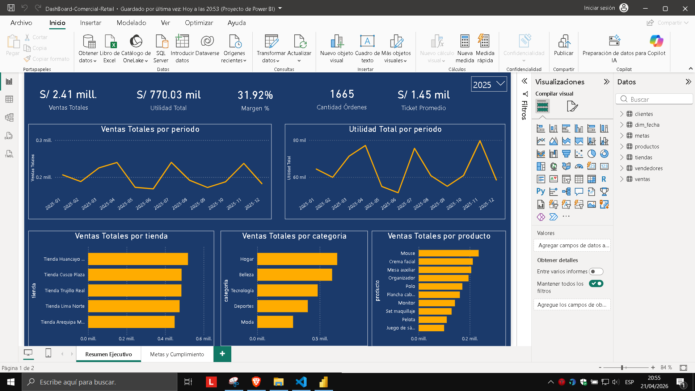
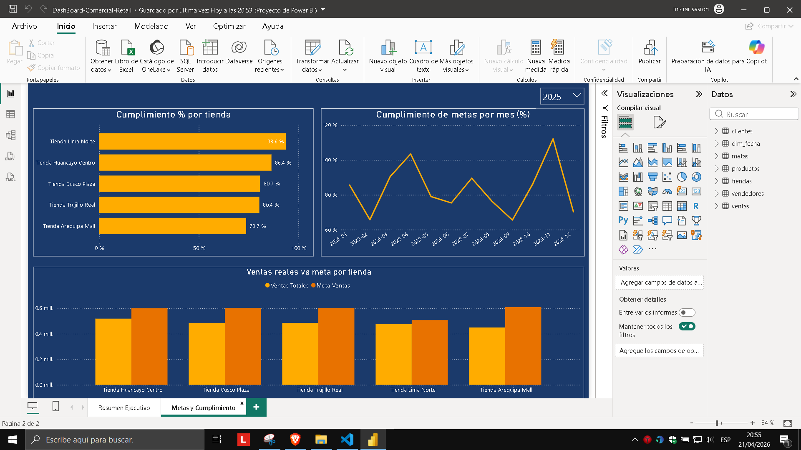

# Dashboard Comercial Retail

Proyecto de portafolio de análisis de datos y business intelligence orientado a evaluar el desempeño comercial de una empresa retail ficticia mediante Python, SQL Server y Power BI.

## Objetivo del proyecto

Analizar el rendimiento comercial de una empresa retail para identificar oportunidades de mejora en ventas, utilidad, margen, cumplimiento de metas y desempeño por tienda, categoría y producto.

## Caso de negocio

**Retail Andino S.A.C.** es una empresa retail ficticia con presencia en varias ciudades del Perú.  
La gerencia necesita un dashboard ejecutivo para monitorear indicadores clave del negocio y apoyar la toma de decisiones comerciales.

## Objetivos de análisis

- Analizar las ventas totales y utilidad total
- Evaluar el margen de rentabilidad
- Medir el ticket promedio y la cantidad de órdenes
- Comparar el desempeño por tienda
- Comparar el desempeño por categoría
- Identificar los productos con mayores ventas
- Evaluar el cumplimiento de metas comerciales por tienda y por periodo

## Herramientas utilizadas

- **Python**
- **pandas**
- **SQL Server Express**
- **SQL Server Management Studio (SSMS)**
- **Power BI Desktop**
- **Git**
- **GitHub**

## Estructura del proyecto

```text
dashboard-comercial-retail/
├── data/
│   ├── raw/
│   └── processed/
├── sql/
│   ├── 01_create_tables.sql
│   ├── 02_load_data.sql
│   └── 03_analysis_queries.sql
├── notebooks/
│   ├── generar_dataset.py
│   ├── revisar_dataset.py
│   ├── procesar_dataset.py
│   └── generar_dim_fecha.py
├── powerbi/
│   ├── DashBoard-Comercial-Retail.pbix
│   ├── theme-retail-ejecutivo.json
├── images/
│   ├── resumen-ejecutivo.png
│   └── metas-y-cumplimiento.png
└── README.md
```

## Dataset

Se trabajó con un dataset simulado, diseñado con un contexto de negocio realista.

### Tablas principales

- clientes
- productos
- tiendas
- vendedores
- ventas
- metas
- dim_fecha

### Cobertura del dataset

- **Periodo:** 2023-01-01 a 2025-12-31
- **Tiendas:** Huancayo, Lima, Arequipa, Trujillo y Cusco
- **Categorías:** Tecnología, Hogar, Moda, Deportes y Belleza

## Proceso desarrollado

### 1. Generación y validación de datos
Se generó un dataset comercial ficticio con Python, incluyendo clientes, productos, tiendas, vendedores, ventas y metas.

### 2. Procesamiento y modelado
Se prepararon tablas procesadas y una dimensión fecha para facilitar el análisis temporal.

### 3. Carga en SQL Server
Los archivos CSV fueron cargados en SQL Server mediante scripts de creación de tablas y carga masiva.

### 4. Análisis exploratorio con SQL
Se desarrollaron consultas para obtener KPIs, ventas por tienda, ventas por categoría, top productos y cumplimiento de metas.

### 5. Construcción del dashboard en Power BI
Se creó un dashboard de dos páginas:
- **Resumen Ejecutivo**
- **Metas y Cumplimiento**

## KPIs principales

- **Ventas Totales**
- **Utilidad Total**
- **Margen %**
- **Cantidad de Órdenes**
- **Ticket Promedio**
- **Cumplimiento %**

## Dashboard

### Resumen Ejecutivo


### Metas y Cumplimiento


## Principales análisis incluidos

- Ventas totales por periodo
- Utilidad total por periodo
- Ventas totales por tienda
- Ventas totales por categoría
- Top productos por ventas
- Cumplimiento de metas por tienda
- Cumplimiento de metas por mes
- Comparación entre ventas reales y metas

## Hallazgos principales

- El dashboard permite identificar diferencias claras de desempeño entre tiendas.
- Se observan categorías con mayor aporte comercial y otras con menor contribución.
- El análisis de cumplimiento permite detectar tiendas cercanas o por debajo de la meta.
- El seguimiento por periodo facilita identificar variaciones mensuales en ventas y utilidad.
- El análisis de productos ayuda a reconocer cuáles concentran mayor volumen de ventas.

## Aprendizajes del proyecto

Este proyecto permitió reforzar conocimientos en:

- Generación y limpieza de datos con Python
- Modelado y carga de datos en SQL Server
- Consultas analíticas en SQL
- Modelado relacional y medidas en Power BI
- Diseño de dashboards ejecutivos para negocio

## Documentación adicional

- [Documentación técnica del proyecto](docs/documentacion-tecnica-dashboard-retail.pdf)

## Autor

**Alexis Suasnabar Gaspar**  
Proyecto desarrollado como parte de mi portafolio para roles de Analista de Datos Junior / BI Junior.
